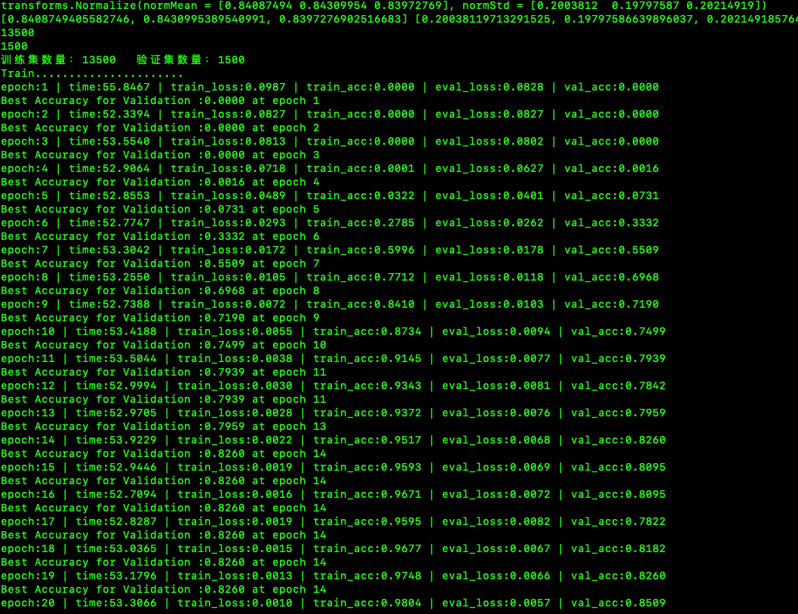
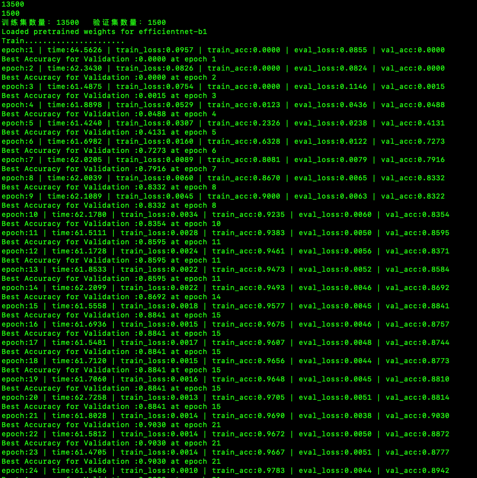

# captcha_ocr
# --------2022DCIC-基于文本字符的交易验证码识别-baseline--------

## 比赛地址
https://www.dcic-china.com/competitions/10023
## 介绍
```bash
    验证码作为性价较高的安全验证方法，在多场合得到了广泛的应用，有效地防止了机器人进行身份欺骗，其中，以基于文本字符的静态验证码最为常见。随着使用的深入，噪声点、噪声线、重叠、形变等干扰手段层出不穷，不断提升安全防范级别。RPA技术作为企业数字化转型的关键，因为其部署的非侵入式备受企业青睐，验证码识别率不高往往限制了RPA技术的应用。一个能同时过滤多种干扰的验证码模型，对于相关自动化技术的拓展使用有着一定的商业价值。
赛题任务：
    本次大赛以已标记字符信息的实例字符验证码图像数据为训练样本，参赛选手需基于提供的样本构建模型，对测试集中的字符验证码图像进行识别，提取有效的字符信息。训练数据集不局限于提供的数据，可以加入公开的数据集。
```
## 代码环境
```bash
    baseline是基于pytorch框架的，版本为1.6+
    其他库如OpenCV、torchvision自行安装
    如果使用efficientnet模型，
        安装命令：pip install efficientnet_pytorch 
        使用请参考 https://github.com/lukemelas/EfficientNet-PyTorch
```
## 数据处理
```bash
    需要将训练数据解压到data/trian
    需要将测试数据解压到data/test
```
## 代码介绍
```bash
    captcha_dataset.py
        数据处理、加载
    config.py
        训练配置文件
    train.py
        训练文件
        模型切换，如果使用resnet34,则需要将下面的注释开，同时注释efficientnet模型
            # 使用框架封装好的模型，使用预训练模型resnet34
            # model = models.resnet34(pretrained=True)
            # # 使用预训练模型需要修改fc层
            # num_fcs = model.fc.in_features
            # # print(num_fcs)
            # model.fc = nn.Sequential(
            #     nn.Linear(num_fcs, num_classes)
            # )
            # 使用efficientnet网络模型
            model = EfficientNet.from_pretrained('efficientnet-b1', num_classes=248)
        如果使用多卡训练需要设置
        os.environ['CUDA_VISIBLE_DEVICES'] = '0,1,2'  指定使用的GPU
        然后取消236、237行的注释
        # device_ids = [0, 1, 2]
        # model = torch.nn.DataParallel(model, device_ids=device_ids)
    predict.py
        预测文件，并生成提交文件
```
## 关于分数

没有提交成绩,贴出部分训练过程
resnet34  分数88+
 
efficientb1  分数92+
 

